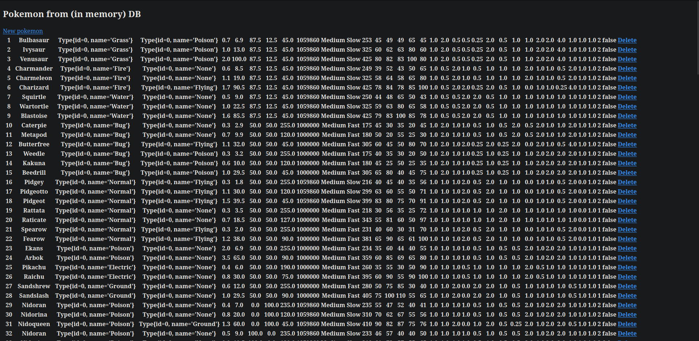

[![Contributors][contributors-shield]][contributors-url]
[![Forks][forks-shield]][forks-url]
[![Stargazers][stars-shield]][stars-url]
[![Issues][issues-shield]][issues-url]
[![MIT License][license-shield]][license-url]
[![LinkedIn][linkedin-shield]][linkedin-url]


<!-- PROJECT LOGO -->
<br />
<p align="center">
  <a href="https://github.com/KacperKurz/Pokemon-API">
  </a>

  <h3 align="center">Pokemon API</h3>

  <p align="center">
    REST API for gen 1 Pokemon created for my java-spring course.
    <br />
    <a href="https://github.com/KacperKurz/Pokemon-API"><strong>Explore the docs »</strong></a>
    <br />
    <br />
    <a href="https://github.com/KacperKurz/Pokemon-API/issues">Report Bug</a>
    ·
    <a href="https://github.com/KacperKurz/Pokemon-API/issues">Request Feature</a>
  </p>


<!-- TABLE OF CONTENTS -->
<details open="open">
  <summary><h2 style="display: inline-block">Table of Contents</h2></summary>
  <ol>
    <li>
      <a href="#about-the-project">About The Project</a>
      <ul>
        <li><a href="#built-with">Built With</a></li>
      </ul>
    </li>
    <li>
      <a href="#getting-started">Getting Started</a>
      <ul>
        <li><a href="#prerequisites">Prerequisites</a></li>
        <li><a href="#installation">Installation</a></li>
      </ul>
    </li>
    <li><a href="#usage">Usage</a></li>
    <li><a href="#contact">Contact</a></li>
    <li><a href="#acknowledgements">Acknowledgements</a></li>
  </ol>
</details>


<!-- ABOUT THE PROJECT -->
## About The Project




### Built With

* [Java]()
* [Spring](https://spring.io/)


<!-- GETTING STARTED -->
## Getting Started

To get a local copy up and running follow these simple steps.

### Prerequisites

* Java 11
* hsqldb

### Installation

1. Clone the repo
   ```sh
   git clone https://github.com/KacperKurz/Pokemon-API.git
   ```
2. Run the database
    ```shell
    hsqldb-server --database.0 mem:mydb --dbname.0 workdb
    ```
3. Run the application
    ```shell
   gradle bootRun
    ```


<!-- USAGE EXAMPLES -->
## Usage

You can see all the entries at http://localhost:8080/web/pokemon/

The api is also available at http://localhost:8080/api/pokemon/

The available endpoints are:
* GET /api/pokemon/ - returns all the entries
* GET /api/pokemon/byType/{type} - returns all the entries of a given type
* GET /api/pokemon/{id} - returns a single entry
* POST /api/pokemon/ - adds a new entry
* DELETE /api/pokemon/{id} - deletes a single entry


<!-- CONTACT -->
## Contact

Kacper Kurz - kacperkurz@protonmail.com

Project Link: [https://github.com/KacperKurz/Pokemon-API](https://github.com/KacperKurz/Pokemon-API)


<!-- ACKNOWLEDGEMENTS -->
## Acknowledgements

* [kaggle](https://www.kaggle.com/datasets/dizzypanda/gen-1-pokemon)


<!-- MARKDOWN LINKS & IMAGES -->
<!-- https://www.markdownguide.org/basic-syntax/#reference-style-links -->
[contributors-shield]: https://img.shields.io/github/contributors/KacperKurz/Pokemon-API.svg?style=for-the-badge
[contributors-url]: https://github.com/KacperKurz/Pokemon-API/graphs/contributors
[forks-shield]: https://img.shields.io/github/forks/KacperKurz/Pokemon-API.svg?style=for-the-badge
[forks-url]: https://github.com/KacperKurz/Pokemon-API/network/members
[stars-shield]: https://img.shields.io/github/stars/KacperKurz/Pokemon-API.svg?style=for-the-badge
[stars-url]: https://github.com/KacperKurz/Pokemon-API/stargazers
[issues-shield]: https://img.shields.io/github/issues/KacperKurz/Pokemon-API.svg?style=for-the-badge
[issues-url]: https://github.com/KacperKurz/Pokemon-API/issues
[license-shield]: https://img.shields.io/github/license/KacperKurz/Pokemon-API.svg?style=for-the-badge
[license-url]: https://github.com/KacperKurz/Pokemon-API/blob/master/LICENSE.txt
[linkedin-shield]: https://img.shields.io/badge/-LinkedIn-black.svg?style=for-the-badge&logo=linkedin&colorB=555
[linkedin-url]: https://linkedin.com/in/kacper-kurz-175707199/
